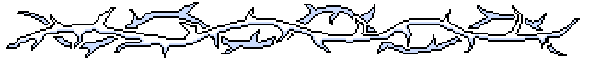

 

 

  <h2>🐍 Contributions 🐍</h2>
  <picture>
  <source media="(prefers-color-scheme: dark)" srcset="https://raw.githubusercontent.com/dsbfelipe/dsbfelipe/output/github-contribution-grid-snake-dark.svg" />
  <source media="(prefers-color-scheme: light)" srcset="https://raw.githubusercontent.com/dsbfelipe/dsbfelipe/output/github-contribution-grid-snake.svg" />
  
</picture>

 
 
<h2 align="center">💻 Technologies 💻</h2>

    <h3>Main stack:</h3>
    
    <h3>Tools:</h3>
       

<h2></h2>

<h3 align="center">Where to find me:</h3>
 

 
 

