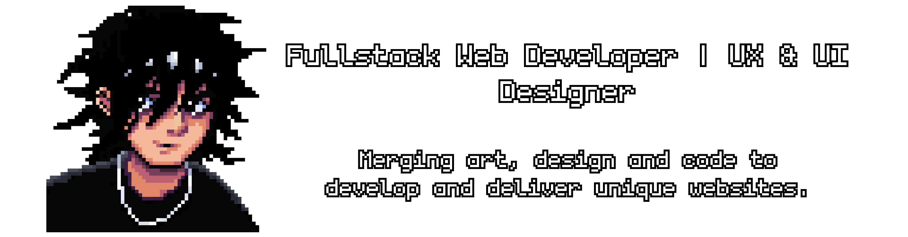

<h1 align="center" media="(prefers-color-scheme: dark)"> 
    

</h1>

 

  <h2>🐍 Contributions 🐍</h2>
  <picture>
  <source media="(prefers-color-scheme: dark)" srcset="https://raw.githubusercontent.com/dsbfelipe/dsbfelipe/output/github-contribution-grid-snake-dark.svg" />
  <source media="(prefers-color-scheme: light)" srcset="https://raw.githubusercontent.com/dsbfelipe/dsbfelipe/output/github-contribution-grid-snake.svg" />
  
</picture>
  

 

 
<h2 align="center">💻 Technologies 💻</h2>

    <h3>Main stack:</h3>
    
    <h3>Tools:</h3>
       

 vscode,git,figma

<h2></h2>

<h3 align="center">Where to find me:</h3>

 

 

<h2></h2>

<h3 align="center">
    

    
</h3>

