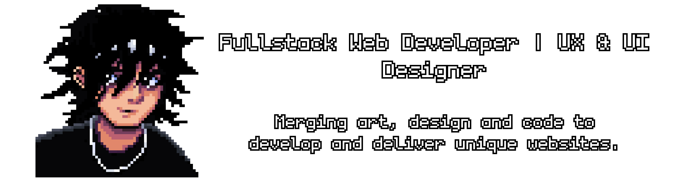

 

    
 
 
<h2 align="center">💻 Technologies 💻</h2>

    <h3>Favorite languages, frameworks and libraries:</h3>
    
     
    
    <h3>Favorite tools:</h3>
    

<h2></h2>

<h3 align="center">Where to find me:</h3>
 

 
